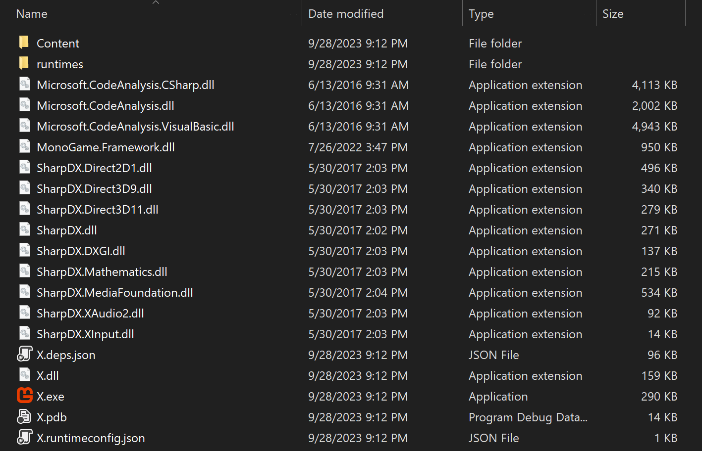
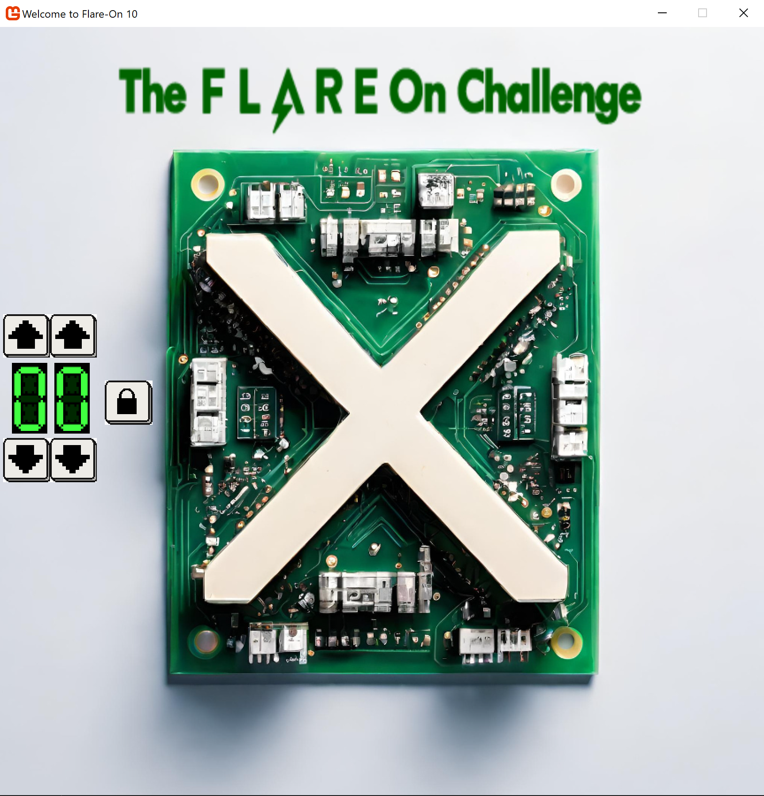
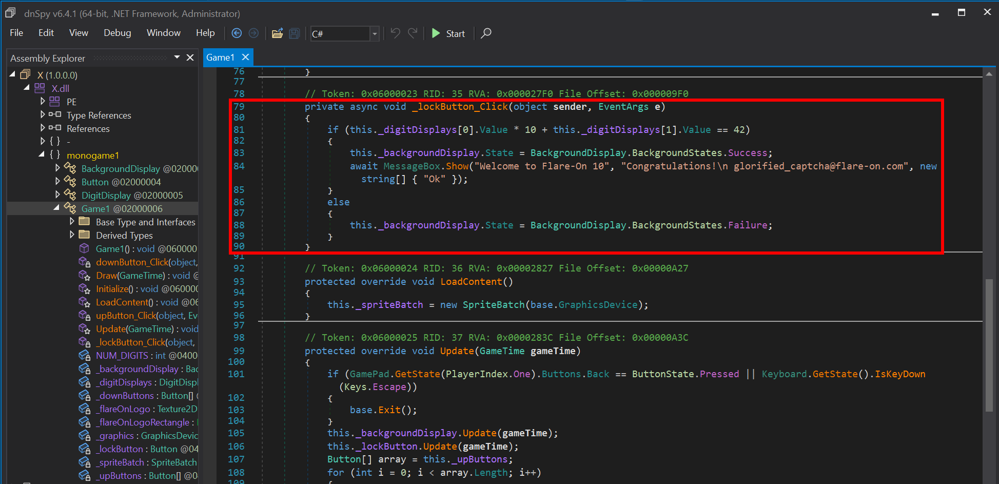
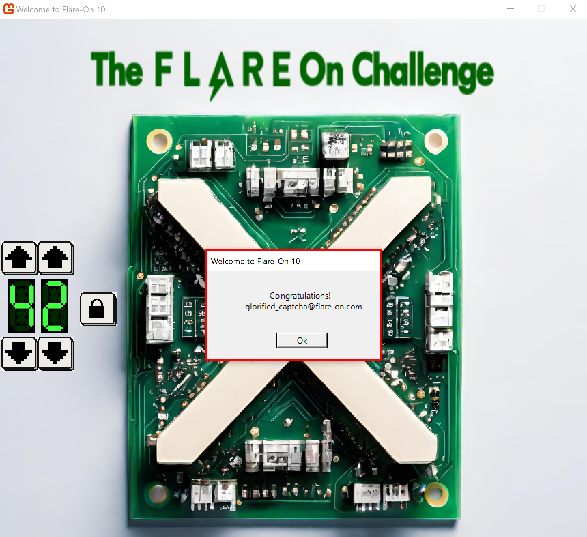

# Challenge 1: X

Welcome to the 10th Annual Flare-On Challenge!

Statistically, you probably won’t finish every challenge. Every journey toward excellence starts somewhere though, and yours starts here. Maybe it ends here too.

This package contains many files and, I can’t believe i’m saying this, click the one with the “.exe” file extension to launch the program. Maybe focus your “reverse engineering” efforts on that one too.

7-zip password: flare

Challenge file: [X](../challenge_files/1_X.7z)

# Solution

The competition starts with an easy challenge. You download and decompress the challenge file, and you get the following list of files:

If you run the app (X.exe), the following window appears:

It seems that we're supposed to enter a specific number to get the flag.

Looking at the challenge files, we notice two interesting files:
* `X.exe`
* `X.dll`

If we throw `X.dll` in dnSpy and navigate through the code responsible for checking for the correct answer, we get the flag:

This means that if we enter the number "42" in the captcha, we get the "congrats" message box.

