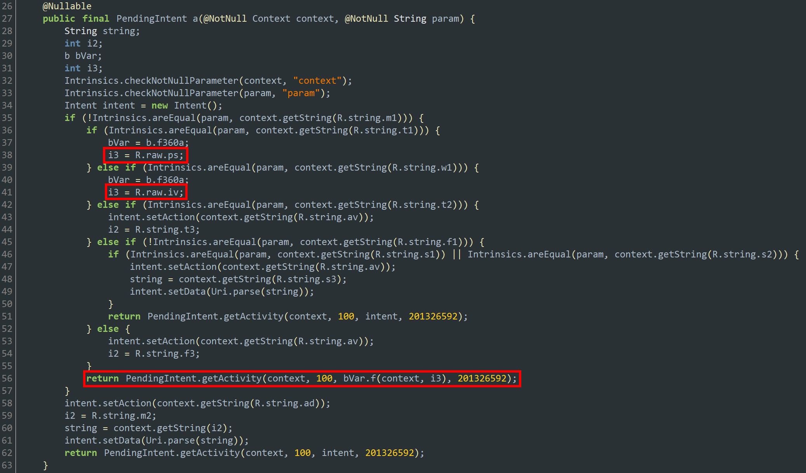

# Challenge 2: ItsOnFire

The FLARE team is now enthusiastic about Google products and services but we suspect there is more to this Android game than meets the eye.

7-zip password: flare

Challenge file: [ItsOnFire](../challenge_files/2_ItsOnFire.7z)

# Solution

This challenge will require a bit of work. You download and decompress the challenge file, and you get the following APK file:


There are few ways to solve this challenge. You can approach it statically without running the application, or you can just analyze it statically and then trigger the flag decryption dynamically.

In this writeup, I'll opt for the latter option.


First, we'll need to set up an Android emulator. In this case, I'll use [NoxPlayer](https://www.bignox.com/).


Once your environment is setup, we'll download and install the APK `ItsOnFire.apk`. Once installed, the app icon should show up as follows:


Running the app shows that it's a simple video game:


Next, we'll try to analyze it statically to understand where the flag lies, and how it can be obtained.

We'll throw the APK in JADX and export all the sources to a folder.

In the folder containing the exported files, we notice two `.png` files within `resources\res\raw`:


However, they're not normal `.png`. Using [Detect It Easy](https://github.com/horsicq/Detect-It-Easy) to view the entropy suggests that they're most likely encrypted:


We'll keep note of this.

Within the exported source, there's also a file that contains a lot of strings `res/values/strings.xml`. The following are some of the interesting ones:

```xml
...
<string name="ag">AES</string>
<string name="aias">android.intent.action.SEND</string>
<string name="alg">AES/CBC/PKCS5Padding</string>
<string name="androidx_startup">androidx.startup</string>
<string name="app_name">ItsOnFire!</string>
<string name="av">android.intent.action.VIEW</string>
<string name="bd">Best Day of the Week?</string>
<string name="c2">https://flare-on.com/evilc2server/report_token/report_token.php?token=</string>
<string name="f1">friday</string>
...
<string name="google_storage_bucket">myevilapp-2e278.appspot.com</string>
...
<string name="key">my_custom_key</string>
<string name="m1">monday</string>
...
<string name="mime">image/png</string>
<string name="mn">onMessageReceived</string>
...
<string name="playerdata">playerscore.png</string>
...
<string name="s1">saturday</string>
<string name="s2">sunday</string>
<string name="s3">https://youtu.be/dsgBpsNPQ50</string>
<string name="search_menu_title">Search</string>
<string name="selected">Selected</string>
<string name="status_bar_notification_info_overflow">999+</string>
<string name="t1">tuesday</string>
<string name="t2">thursday</string>
<string name="t3">google.streetview:panoid=gT28ssf0BB2LxZ63JNcL1w&amp;cbp=0,288,0,0,0</string>
...
<string name="title">Notification!</string>
<string name="w1">wednesday</string>
```

We can see that there are some indication that there could be something (the flag?) that is encrypted using AES as that's the algorithm listed in the strings.

Next, we'll take a look at the decompiled code. One thing that caught my attention is the following code snippet:



Could `R.raw.ps` and `R.raw.iv` be referring to the files we listed previously and identified as encrypted?

Also, the code snippet above suggests that it takes specific branches according the the `param` parameter. As shown in the `strings.xml` listing above, `param` is being checked against the values of week days. For example, `R.string.m1` maps to `monday`, `R.string.t1` maps to "tuesday", `R.string.w1` maps to "wednesday",... and so on.

Each value will take you to a specific branch. The branches we're interested in are `R.string.t1`, and `R.string.w1` which belong to the encrypted files.

Additionally, if we continue the flow and follow the function `f` (line 56), we'll see that there's some decryption going on.


That said, now we need to understand how we can trigger the execution of this function (function `a`) along with the desired `param` value.

This function gets called from `onMessageReceived` as shown in the following figure:


`onMessageReceived` is a callback method associated with receiving messages in the context of Firebase Cloud Messaging (FCM) that the app uses.

Simply put, `onMessageReceived` is triggered whenever you receive a message from FCM while the app is running.

To trigger this function, we need to simulate a message receipt with the specific custom key `R.string.key` (which is `my_custom_key`) in which we specify the day in.

To do this, I'll use Frida. I wrote the following script to trigger the execution `onMessageReceived` supplying `tuesday` as a key.

```js
// frida.exe -U -F com.secure.itsonfire -l .\ItsOnFire_trigger_decryption.js
Java.perform(function () {
    const ActivityThread = Java.use('android.app.ActivityThread')
    const currentApplication = ActivityThread.currentApplication()
    const context = currentApplication.getApplicationContext()

    var Intent = Java.use('android.content.Intent');
    var action = 'com.google.android.c2dm.intent.RECEIVE';

    var fcmIntent = Intent.$new(action);
    fcmIntent.putExtra('my_custom_key', 'tuesday');

    var FcmBroadcastProcessor = Java.use('com.google.firebase.messaging.FcmBroadcastProcessor');
    FcmBroadcastProcessor.$new(context).process(fcmIntent);
    console.log("Done.");
});
```


We'll run Frida server with in NoxPlayer, start the app, and inject our script. This will show the following notification:


If you click on the notification, it'll ask you to save a file (i.e., the decrypted `ps.png` file). You can save it anywhere. This results into the following meme picture getting decrypted:


Now if you change the key `my_custom_key` to `wednesday`, you get the flag. Make sure you delete the previous file as it save it with the same name.


