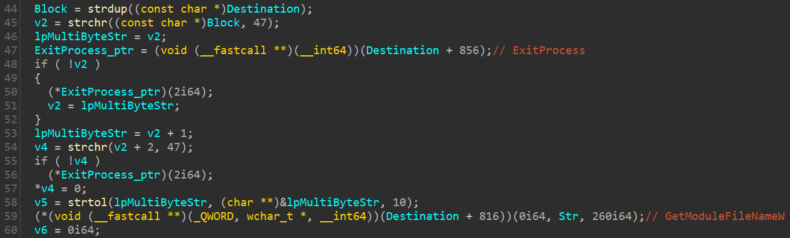
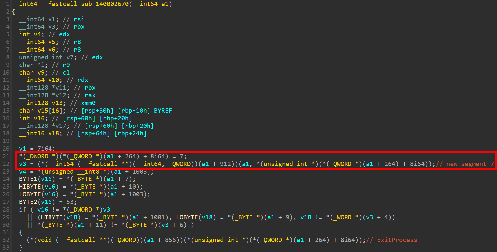

# Challenge 3: mypassion

This is one of those ones that will work under the right circumstances, Steve. May I call you Steve? Before you take to twitter complaining about a broken challenge, think about how you can be the change you want to see in the world, Steve.

7-zip password: flare

# Solution

This is one of the harder challenges this year. It requires some work in deciphering shellcodes.

This challenge is all about understanding how the first argument gets parsed within the application so that you can give it an input that fits the expected value within the context.

In the main function, you can see that all the juicy stuff occur when the length of the `argc` is `2`:


Initially, we see in `main` that the program exits and logs off the session (logic in `exit` function) if the following conditions are not met.
* the first letter of the first argument `argv[1]` is not `0` (ASCII value 0x30).
* the second letter shifted left by two + third letter (i.e., `ord(argv[1][2]) + (ord(argv[1][1]) << 2) != 0x127`) 

If any of the above conditions is is true, the app will exit.

To find some possible combinations of ASCII letters that meet this criteria, we can write this simple program:

```python
combinations = []
for letter2 in range(0x20, 0x7f):
    for letter3 in range(0x20, 0x7f):
        if letter3 + (letter2 << 2) == 0x127:
            combinations.append((chr(letter2), chr(letter3)))
for combo in combinations:
    print("letter2: {} letter3: {}".format(combo[0], combo[1]))
```

I'll choose the combination (letter2: `5` letter3:`S`).

Now we place a breakpoint at `base+0x109D` and run the program with the argument `05Sabcdefghijklmnopqrstuvwxyz`, we notice that we pass the check, which means we do not exit:


There's another check at `0x10fe` that compares the 6th letter with `R`, so we'll modify our argument to be `05SabRdefghijklmnopqrstuvwxyz`.


Now that we've passed the initial checks, it's time to dive deeper!

Now if we place a breakpoint at the `VirtualAlloc` call, we'll notice that there's something that is not right.

```
0:000> bp sym + 11b0

0:000> g
ModLoad: 00007ff8`a3900000 00007ff8`a3930000   C:\Windows\System32\IMM32.DLL
Breakpoint 0 hit
sym+0x11b0:
00007ff7`da2611b0 ff15121f0100    call    qword ptr [sym+0x130c8 (00007ff7`da2730c8)] ds:00007ff7`da2730c8={KERNEL32!VirtualAllocStub (00007ff8`a3948810)}

0:000> p
sym+0x11b6:
00007ff7`da2611b6 488bf8          mov     rdi,rax

0:000> r rax
rax=0000000000000000

0:000> !gle
LastErrorValue: (Win32) 0x57 (87) - The parameter is incorrect.
LastStatusValue: (NTSTATUS) 0xc0000045 - The specified page protection was not valid.
```

`VirtualAlloc`'s `flProtect` is not correct. Why? 

```
Breakpoint 0 hit
sym+0x11b0:
00007ff7`da2611b0 ff15121f0100    call    qword ptr [sym+0x130c8 (00007ff7`da2730c8)] ds:00007ff7`da2730c8={KERNEL32!VirtualAllocStub (00007ff8`a3948810)}

0:000> r r9
r9=0000000000000064
```

According to [MSDN](https://learn.microsoft.com/en-us/windows/win32/Memory/memory-protection-constants), `0x64` does not represent a valid protection value. If we look closer at the `main` function, we'll notice that our input affects this parameter. `0x64` is the ASCII value of `d`, which is the 7th letter in our input. We'll modify the 7th letter to be `@`, which represents `PAGE_EXECUTE_READWRITE`.

We'll rerun the binary with the argument `05SabR@efghijklmnopqrstuvwxyz`, and we'll notice that `VirtualAlloc` executes successfully this time.

```
0:000> bp sym + 11b0

0:000> g
Breakpoint 0 hit
sym+0x11b0:
00007ff7`da2611b0 ff15121f0100    call    qword ptr [sym+0x130c8 (00007ff7`da2730c8)] ds:00007ff7`da2730c8={KERNEL32!VirtualAllocStub (00007ff8`a3948810)}

0:000> r r9
r9=0000000000000040

0:000> p
sym+0x11b6:
00007ff7`da2611b6 488bf8          mov     rdi,rax

0:000> r rax
rax=000001822f990000
```

Next, we notice that there's a call to `sub_140003f10`, which is essentially a `memset` function that Binary Ninja failed to recognize. It zeros a region within the stack.

After executing `memset`, the `VirtualAlloc` allocated chunk gets overwritten by a shellcode which is then executed. Notice that the 13th letter of our argument overwrites the offset `0x41` of the shellcode. 

A better look of that code is provided by IDA:


If we continue the execution of the binary with the current argument, we get an exception:

```
(26d8.1c8c): Illegal instruction - code c000001d (first chance)
(26d8.1c8c): Illegal instruction - code c000001d (!!! second chance !!!)
00000290`773c0040 c6              ???
```

If we inspect the shellcode before executing it, we'll notice that it has a bad instruction:

```
0:000> u rdi L14
000001d9`6dad0000 4055            push    rbp
000001d9`6dad0002 488bec          mov     rbp,rsp
000001d9`6dad0005 4883ec10        sub     rsp,10h
000001d9`6dad0009 c6451874        mov     byte ptr [rbp+18h],74h
000001d9`6dad000d 4c8d55f0        lea     r10,[rbp-10h]
000001d9`6dad0011 c6451965        mov     byte ptr [rbp+19h],65h
000001d9`6dad0015 4c8d5df0        lea     r11,[rbp-10h]
000001d9`6dad0019 c6451a6e        mov     byte ptr [rbp+1Ah],6Eh
000001d9`6dad001d 33c0            xor     eax,eax
000001d9`6dad001f c6451b00        mov     byte ptr [rbp+1Bh],0
000001d9`6dad0023 4c8bc1          mov     r8,rcx
000001d9`6dad0026 8945f0          mov     dword ptr [rbp-10h],eax
000001d9`6dad0029 4533c9          xor     r9d,r9d
000001d9`6dad002c 668945f4        mov     word ptr [rbp-0Ch],ax
000001d9`6dad0030 c645f016        mov     byte ptr [rbp-10h],16h
000001d9`6dad0034 c645f117        mov     byte ptr [rbp-0Fh],17h
000001d9`6dad0038 c645f23b        mov     byte ptr [rbp-0Eh],3Bh
000001d9`6dad003c c645f317        mov     byte ptr [rbp-0Dh],17h
000001d9`6dad0040 c6              ???
000001d9`6dad0041 6af4            push    0FFFFFFFFFFFFFFF4h
```

As expected, the letter `j` in our argument overwrote the shellcode, which resulted in a bad instruction.

We also note that the first argument when this call happens is our argument as well:

```
0:000> dc rcx
00000091`57effa50  68676665 00000069 00000000 00000000  efghi...........
```

To help through the shellcode debugging, I used [CyberChef](https://gchq.github.io/CyberChef/#recipe=Disassemble_x86('64','Full%20x86%20architecture',16,0,false,true)&input=NDAgNTUgNDggOGIgZWMgNDggODMgZWMgMTAgYzYgNDUgMTggNzQgNGMgOGQgNTUgZjAgYzYgNDUgMTkgNjUgNGMgOGQgNWQgZjAgYzYgNDUgMWEgNmUgMzMgYzAgYzYKNDUgMWIgMDAgNGMgOGIgYzEgODkgNDUgZjAgNDUgMzMgYzkgNjYgODkgNDUgZjQKYzYgNDUgZjAgMTYgYzYgNDUgZjEgMTcgYzYgNDUgZjIgM2IgYzYgNDUgZjMgMTcKYzYgNmEgZjQgNTYgYjggYWIgYWEgYWEgYWEgNDEgOGIgYzkgNDEgZjcgZTEgNDEKZmYgYzEgZDEgZWEgOGQgMDQgNTIgMmIgYzggNDggNjMgYzEgOGEgNGMgMDUgMTgKNDEgOGEgMDIgNDkgZmYgYzIgMzIgYzEgNDEgODggMDMgNDkgZmYgYzMgNDEgODMKZjkgMDUgN2MgZDAgNDggOGQgNDUgZjAgNGMgMmIgYzAgMGYgYjYgMDggNDIgMGYKYjYgMTQgMDAgMmIgY2EgNzUgMDcgNDggZmYgYzAgODUgZDIgNzUgZWQgODUgYzkKMGYgOTQgYzAgNDggODMgYzQgMTAgNWQgYzM). 

> **SIDE NOTE**
>
> Don't depend entirely on CyberChef disassembler. It sometimes gives incorrect instructions. Always check instructions in the debugger.

For now, we just want to continue the execution of the binary, so we'll modify the letter 13th `j` to any value that fits within the context. For example, let's use `E`, which results into [this](https://gchq.github.io/CyberChef/#recipe=Disassemble_x86('64','Full%20x86%20architecture',16,0,true,true)&input=NDAgNTUgNDggOGIgZWMgNDggODMgZWMgMTAgYzYgNDUgMTggNzQgNGMgOGQgNTUgZjAgYzYgNDUgMTkgNjUgNGMgOGQgNWQgZjAgYzYgNDUgMWEgNmUgMzMgYzAgYzYKNDUgMWIgMDAgNGMgOGIgYzEgODkgNDUgZjAgNDUgMzMgYzkgNjYgODkgNDUgZjQKYzYgNDUgZjAgMTYgYzYgNDUgZjEgMTcgYzYgNDUgZjIgM2IgYzYgNDUgZjMgMTcKYzYgNDUgZjQgNTYgYjggYWIgYWEgYWEgYWEgNDEgOGIgYzkgNDEgZjcgZTEgNDEKZmYgYzEgZDEgZWEgOGQgMDQgNTIgMmIgYzggNDggNjMgYzEgOGEgNGMgMDUgMTgKNDEgOGEgMDIgNDkgZmYgYzIgMzIgYzEgNDEgODggMDMgNDkgZmYgYzMgNDEgODMKZjkgMDUgN2MgZDAgNDggOGQgNDUgZjAgNGMgMmIgYzAgMGYgYjYgMDggNDIgMGYKYjYgMTQgMDAgMmIgY2EgNzUgMDcgNDggZmYgYzAgODUgZDIgNzUgZWQgODUgYzkKMGYgOTQgYzAgNDggODMgYzQgMTAgNWQgYzM). This should continue the program execution without having an invalid instruction.

The updated argument is `05SabR@efghiEklmnopqrstuvwxyz`.

```
0:000> bp sym + 1299

0:000> g
Breakpoint 0 hit
sym+0x1299:
00007ff7`da261299 ffd7            call    rdi {0000016b`60910000}

0:000> p
sym+0x129b:
00007ff7`da26129b 4c8b4308        mov     r8,qword ptr [rbx+8] ds:0000016b`609962d8=0000016b6099632e
```

As shown, now the call to the shellcode isn't failing.

Next, I'll list the behavior of the unrecognized functions (shown in the figure above) is as follows:

`sub_140001000`: a wrapper around `strnlen`.
`sub_140002F00`: retrieves a segment separated by `/`. First argument is the source string and the second is an integer representing the segment to be retrieved.
`sub_140002C00`: does sha256sum of the provided input.
`sub_140002D20`: decrypts data.
`sub_140002DB0`: Writes an HTML file and then opens it.
`sub_1400018B0`: requires further discussion, but it mainly contains the binary's logic.

`sub_1400013E0`: is the runner function. It takes data within the `Destination` and performs the required functions according to the binary's logic. 

We'll next focus on the call to `sub_1400013E0` function at `0x13c6` as it is the interesting one that gets executed after the initial `VirtualAlloc`.

`sub_1400013E0` starts with checking if `/` is present within the supplied argument. If not, then it exits.



In order to pass those checks and not exit, we'll modify the argument to be `05SabR@efghiEklmnopqrstuvwxyz/test/test`. If we let the program executes with this argument, it'll create a new file called `test` (from our argument) within the current folder. 

Checking the the entropy of the file indicates that it's probably encrypted.


The program continues all the way until the end of `sub_1400013E0`, but it calls another shellcode at `0x1892`.

This shellcode is decrypted using the sha256 hash of the word `turnitup` as shown in the following figure:


We'll try to dump the shellcode and analyze it:

```
Breakpoint 0 hit
sym+0x1892:
00007ff7`da261892 ffd0            call    rax {00000174`70800000}

0:000> db rax L0n176
00000174`70800000  48 89 5c 24 10 48 89 74-24 18 57 48 83 ec 20 48  H.\$.H.t$.WH.. H
00000174`70800010  8b 81 08 01 00 00 48 8b-d9 c7 40 08 03 00 00 00  ......H...@.....
00000174`70800020  48 8b 81 08 01 00 00 8b-50 08 ff 91 90 03 00 00  H.......P.......
00000174`70800030  41 b8 04 00 00 00 48 c7-44 24 30 00 00 00 00 48  A.....H.D$0....H
00000174`70800040  8b c8 48 8d 54 24 30 48-8b f0 ff 93 80 03 00 00  ..H.T$0H........
00000174`70800050  48 8b 4c 24 30 ba 20 00-00 00 8b f8 ff 93 88 03  H.L$0. .........
00000174`70800060  00 00 3b c7 74 12 48 8b-8b 08 01 00 00 8b 49 08  ..;.t.H.......I.
00000174`70800070  ff 93 58 03 00 00 eb 0c-69 cf e8 03 00 00 ff 93  ..X.....i.......
00000174`70800080  50 03 00 00 48 8b ce ff-93 68 03 00 00 48 8b cb  P...H....h...H..
00000174`70800090  ff 93 b0 03 00 00 48 8b-5c 24 38 48 8b 74 24 40  ......H.\$8H.t$@
00000174`708000a0  48 83 c4 20 5f c3 46 9d-81 02 07 00 c7 db 37 8c  H.. _.F.......7.

0:000> dc rcx
000000d1`1d4ff930  61533530 65405262 69686766 6d6c6b45  05SabR@efghiEklm
000000d1`1d4ff940  71706f6e 75747372 79787776 65742f7a  nopqrstuvwxyz/te
000000d1`1d4ff950  742f7473 00747365 00000000 00000000  st/test.........
```


Within this shellcode at `shellcode1+2a`, it calls the function `sub_140002F00`, which gets a segment (separated by `/`):

```
000002c2`926a002a ff9190030000    call    qword ptr [rcx+390h] ds:000000e9`b278f740=00007ff7da262f00

0:000> da rcx
000000e9`b278f3b0  "05SabR@efghiEklmnopqrstuvwxyz/te"
000000e9`b278f3d0  "st/test"

0:000> r rdx
rdx=0000000000000003

0:000> p
000002c2`926a0030 41b804000000    mov     r8d,4

0:000> r rax
rax=0000000000000000
```

As shown, the return value is `NULL` because we have only provided 2 `/`. We'll update the argument include another `/` at the end `05SabR@efghiEklmnopqrstuvwxyz/test/test2/`.

```
000002f0`4296002a ff9190030000    call    qword ptr [rcx+390h] ds:000000f4`0c8ffbf0=00007ff7da262f00

0:000> p
...
0:000> da rax
000002f0`42a3a860  "test2"
```

Right after this call, this shellcode calls `strtol` at `shellcode1+0x4a` with the extracted segment `test3` as its argument. This obviously means that this segment should be a number.

```
000002f0`4296004a ff9380030000    call    qword ptr [rbx+380h] ds:000000f4`0c8ffbe0=00007ff7da2671a0

0:000> da rcx
000002f0`42a3a860  "test2"
```

We'll need to update this segment to be a number `05SabR@efghiEklmnopqrstuvwxyz/test/10test/`.

The `test` at the end is for `strlen` call that comes after at `shellcode1+0x5c`.


`shellcode1+0x90` calls the function `sub_1400018B0` with our argument in `RCX`

```
00000218`33660090 ff93b0030000    call    qword ptr [rbx+3B0h] ds:000000af`819df940=00007ff7da2618b0

0:000> da rcx
000000af`819df590  "05SabR@efghiEklmnopqrstuvwxyz/te"
000000af`819df5b0  "st/10test/"
```

`sub_1400018B0` is a pretty large function, and it includes many other function calls within it.

In this function, we notice this check


The disassembled code is as follows:


Our input is held at `r14`. This is another segment we need to add in our argument. Our input is being checked against a scattered word, so we'll need to read the letters from memory:

```
sym+0x199c:
00007ff7`da26199c 410fb64603      movzx   eax,byte ptr [r14+3] ds:00000000`00000003=??
0:000> da rcx+1e L1
000000af`819df56e  "p"

0:000> da rcx+1d L1
000000af`819df56d  "i"

0:000> da rcx+1f L1
000000af`819df56f  "z"

0:000> da rcx+1c L1
000000af`819df56c  "z"

0:000> da rcx+20 L1
000000af`819df570  "a"
```

It checks the provided input with `pizza` starting from index `1` of the segment. We'll update the argument accordingly `05SabR@efghiEklmnopqrstuvwxyz/test/10test/?pizza/`.

Then we face the following check:


This is a comparison with the first four bytes of in the encrypted file. With the current argument, this check fails and the program exits.

It turns out that we missed some logic in `sub_1400013E0`, and we can control the header through one of the filename segment. This logic is listed in the following figure:


What comes after `1337` in the second segment will be the file name. Next, we notice two checks:


`v33` is responsible for checking if the file name submitted is correct. If we set the second segment to `1337test` and run the program, we get the following:

```
0:000> u RIP L2
sym+0x1c40:
00007ff7`da261c40 0fb710          movzx   edx,word ptr [rax]
00007ff7`da261c43 0fb70c18        movzx   ecx,word ptr [rax+rbx]

0:000> du rax
00000052`21ad4b08  "pr.ost"

0:000> du rax+rbx
000001ac`5ef1a6b0  "test"
```

The second check calls `GetTickCount` and compares it with a previously calculated value + `8000`.

It turns out that the `Sleep` function executed in the previous shellcode has an effect on it. To pass this check, we'll need to set the third segment to `30testtesttest`.

In the last shellcode, we had the following 

```
shellcode1+00 48895c2410      mov     qword ptr [rsp+10h],rbx
shellcode1+05 4889742418      mov     qword ptr [rsp+18h],rsi
shellcode1+0a 57              push    rdi
shellcode1+0b 4883ec20        sub     rsp,20h
shellcode1+0f 488b8108010000  mov     rax,qword ptr [rcx+108h]
shellcode1+16 488bd9          mov     rbx,rcx
shellcode1+19 c7400803000000  mov     dword ptr [rax+8],3
shellcode1+20 488b8108010000  mov     rax,qword ptr [rcx+108h]
shellcode1+27 8b5008          mov     edx,dword ptr [rax+8]
shellcode1+2a ff9190030000    call    qword ptr [rcx+390h]      // get segment 3
shellcode1+30 41b804000000    mov     r8d,4
shellcode1+36 48c744243000000000 mov   qword ptr [rsp+30h],0
shellcode1+3f 488bc8          mov     rcx,rax
shellcode1+42 488d542430      lea     rdx,[rsp+30h]
shellcode1+47 488bf0          mov     rsi,rax
shellcode1+4a ff9380030000    call    qword ptr [rbx+380h]      // strtol
shellcode1+50 488b4c2430      mov     rcx,qword ptr [rsp+30h]
shellcode1+55 ba20000000      mov     edx,20h
shellcode1+5a 8bf8            mov     edi,eax
shellcode1+5c ff9388030000    call    qword ptr [rbx+388h]      // strlen
shellcode1+62 3bc7            cmp     eax,edi                   // check
shellcode1+64 7412            je      00000254`d83a0078
shellcode1+66 488b8b08010000  mov     rcx,qword ptr [rbx+108h]
shellcode1+6d 8b4908          mov     ecx,dword ptr [rcx+8]
shellcode1+70 ff9358030000    call    qword ptr [rbx+358h]
```

To put simply, the string `30testtesttest` is passed to `strtol` to convert. This will convert `30` to a base 4 number. This call returns `0xC` when `30testtesttest` is passed. The check at `shellcode1+62` compares the resulted number from `strtol` with the length of the string `testtesttest`. This obviously will result into passing this check and also passing the `GetTickCount` comparison that comes after checking the file name.


That said, our updated argument now should be `05SabR@efghiEklmnopqrstuvwxyz/1337pr.ost/30testtesttest/?pizza/`.

Next in `sub_1400018B0`, we see a call to `VirtualAllocEx` to reserve a relatively large space.


 
From the allocated size, we assume that this space is likely to be used for the buffer read from the encrypted file as the reserved space matches the size of the encrypted file. This can be confirmed through the `memmove` call.

We also see a call to `sub_140002170`. This is the function we'll analyze next.

Within `sub_140002170`, we notice calls to the functions `sub_140001DA0` and `sub_140001F80`. These two functions simply prepare and return shellcodes. Also, `sub_140002170` prepares another shellcode. We can see three shellcodes in total:


`shellcode2` takes `Beep` as its second argument. [Beep](https://learn.microsoft.com/en-us/windows/win32/api/utilapiset/nf-utilapiset-beep) is a function that simply generates a beep sound. Could `shellcode2` be resolving a function name (in this case `Beep`) based on its argument? If that's the case, then the first argument must be a module handle?

It turns out that this is the case for `shellcode2`. It simply acts as [GetProcAddress](https://learn.microsoft.com/en-us/windows/win32/api/libloaderapi/nf-libloaderapi-getprocaddress).

Since `shellcode2` takes `v5` that is obtained from `shellcode3`, could that mean that `shellcode3` resolves some type of module handle? It turns out that this is the case for `shellcode3`.

For `shellcode1`, we'll dump and analyze it:

```
Breakpoint 0 hit
sym+0x21cc:
00007ff7`da2621cc ffd0            call    rax {00000264`94de0000}

0:000> .writemem C:\\Windows\\Temp\\shellcode_21cc.bin rax L72
Writing 72 bytes.
```


Upon analyzing this shellcode, it turns out that it just acts exactly as `sub_140002F00`, which extracts a segment separated by `/` based on the second argument. 


The second argument to this is `5`, which simply means that it'll extract segment 5 from the argument, so we'll modify the argument to `05SabR@efghiEklmnopqrstuvwxyz/1337pr.ost/30testtesttest/?pizza/ZZZZZZZZZZZZZZZZZZZZZZZZZZZZZZZZZ/`.

We can verify this

```
Breakpoint 0 hit
sym+0x21cc:
00007ff7`da2621cc ffd0            call    rax {000001a9`49360000}

0:000> da rcx
00000022`54fef6a0  "05SabR@efghiEklmnopqrstuvwxyz/13"
00000022`54fef6c0  "37pr.ost/30testtesttest/?pizza/Z"
00000022`54fef6e0  "ZZZZZZZZZZZZZZZZZZZZZZZZZZZZZZZZ"
00000022`54fef700  "/"

0:000> r rdx
rdx=0000000000000005

0:000> p
sym+0x21ce:
00007ff7`da2621ce 488d4de7        lea     rcx,[rbp-19h]
0:000> da rax
00000022`54fc4740  "ZZZZZZZZZZZZZZZZZZZZZZZZZZZZZZZZ"
00000022`54fc4760  "Z"
```

If we continue the execution, we face a crash in `shellcode3`:

```
0:000> g
(1c7c.3264): Access violation - code c0000005 (first chance)
First chance exceptions are reported before any exception handling.
This exception may be expected and handled.
000001a9`49380001 488b042560000000 mov     rax,qword ptr [60h] ds:00000000`00000060=????????????????
```

Obviously, the instruction is invalid as it is dereferencing an invalid memory address. The reason for this crash is that the fifth segment of our input (i.e., `ZZZZZZZZZZZZZZZZZZZZZZZZZZZZZZZZZ`) modifies the shellcode opcodes (both `shellcode3` and `shellcode2`).

To understand this, we'll dump `shellcode3` as it is where we crash:

```
Breakpoint 0 hit
sym+0x2354:
00007ff7`da262354 ffd2            call    rdx {000001df`6a440000}

0:000> db rdx L65
000001df`6a440000  5a 48 8b 04 25 60 00 00-00 48 8b 48 18 48 8b 51  ZH..%`...H.H.H.Q
000001df`6a440010  20 48 83 ea 10 48 8b 42-5a 66 83 78 10 5a 75 2e   H...H.BZf.x.Zu.
000001df`6a440020  66 83 78 0e 32 75 27 66-83 78 0c 33 75 20 66 83  f.x.2u'f.x.3u f.
000001df`6a440030  78 0a 4c 74 07 66 5a 78-08 6c 75 12 0f b7 40 08  x.Lt.fZx.lu...@.
000001df`6a440040  b9 df ff 00 00 66 83 e8-45 66 85 c1 74 12 48 8b  .....f..Ef..t.H.
000001df`6a440050  5a 10 48 83 ea 10 48 83-7a 30 00 75 b8 33 c0 c3  Z.H...H.z0.u.3..
000001df`6a440060  48 8b 42 5a c3                                   H.BZ.
```

As can be seen in [CyberChef disassembler](https://gchq.github.io/CyberChef/#recipe=Disassemble_x86('64','Full%20x86%20architecture',16,0,true,true)&input=NWEgNDggOGIgMDQgMjUgNjAgMDAgMDAtMDAgNDggOGIgNDggMTggNDggOGIgNTEKMjAgNDggODMgZWEgMTAgNDggOGIgNDItNWEgNjYgODMgNzggMTAgNWEgNzUgMmUKNjYgODMgNzggMGUgMzIgNzUgMjcgNjYtODMgNzggMGMgMzMgNzUgMjAgNjYgODMKNzggMGEgNGMgNzQgMDcgNjYgNWEgNzgtMDggNmMgNzUgMTIgMGYgYjcgNDAgMDgKYjkgZGYgZmYgMDAgMDAgNjYgODMgZTgtNDUgNjYgODUgYzEgNzQgMTIgNDggOGIKNWEgMTAgNDggODMgZWEgMTAgNDggODMtN2EgMzAgMDAgNzUgYjggMzMgYzAgYzMKNDggOGIgNDIgNWEgYzMgICAgICAgICAgICAgICAgICAgICAgICAgICAgICAgICA), this shellcode has invalid instructions. If we look at the opcodes, we see several instances of `0x5a` (ASCII value of `Z`).

After further analysis, I came up with the following list of indexes at which our input overwrites the shellcode:

```
Unknown letters indexes in shellcode3: 12, 5, 8, 9, 7, 6

[12] 48 8b 04 25 60 00 00 00  48 8b 48 18 48  8b 51
 20  48 83 ea 10 48 8b 42 [5] 66 83 78 10 [8] 75 2e
 66  83 78 0e 32 75 27  66 83 78 0c 33 75 20 66 83
 78  0a 4c 74 07 66 [9] 78 08 6c 75 12 0f b7 40 08
 b9  df ff 00 00 66 83  e8 45 66 85 c1 74 12 48 8b
[7]  10 48 83 ea 10 48  83 7a 30 00 75 b8 33 c0 c3
 48 8b 42 [6] c3         
```

This means that the letter at index `12` in segment 5 will affect the first byte (byte index `0`), letter at index `5` will affect the byte at index `24`, ... and so on.

Note that the first letter (index `0`) in the fifth segment must equal the 11th letter (index `10`) due to the comparison at `0x22e8`. If not, the program exits.

`Beep` is in `KERNEL32.DLL`. This means that this shellcode must get a handle to `KERNEL32.DLL` module. We need to modify the shellcode (using our entry points supplied by 5th argument) in a way that the shellcode behaves as expected.

To do this, I used the following set of letters:

```
[12] = 0x65 = e
[5]  = 0x60 = `
[8]  = 0x2e = .
[9]  = 0x43 = C
[7]  = 0x52 = R
[6]  = 0x30 = 0
```

OUr updated argument is ```05SabR@efghiEklmnopqrstuvwxyz/1337pr.ost/30testtesttest/?pizza/ZZZZZ`0R.CZZeZZZZZZZZZZZZZZZZZZZZ/```.

```
Breakpoint 0 hit
sym+0x2354:
00007ff7`da262354 ffd2            call    rdx {000002ad`21a10000}

0:000> p
sym+0x2356:
00007ff7`da262356 4885c0          test    rax,rax

0:000> r rax
rax=00007ff8a3930000

0:000> lm m kernel32
Browse full module list
start             end                 module name
00007ff8`a3930000 00007ff8`a39ed000   KERNEL32
```

With this argument, the shellcode works as expected and returns the base address of `KERNEL32.DLL`.

Next, we'll take a look at `shellcode2` that is supposed to resolve the address of `Beep`. We'll set a breakpoint and dump the shellcode:

```
Breakpoint 1 hit
sym+0x236c:
00007ff7`da26236c ffd6            call    rsi {000002ad`21a00000}

0:000> db rsi La1
000002ad`21a00000  48 89 5c 24 08 48 89 7c-24 18 48 89 54 24 10 4c  H.\$.H.|$.H.T$.L
000002ad`21a00010  8b c1 48 85 c9 74 63 b8-5a 5a 00 00 66 39 01 75  ..H..tc.ZZ..f9.u
000002ad`21a00020  59 48 63 41 3c 81 3c 08-50 5a 00 00 75 4c 44 8b  YHcA<.<.PZ..uLD.
000002ad`21a00030  8c 08 88 00 00 00 4c 03-c9 45 8b 59 20 4c 03 d9  ......L..E.Y L..
000002ad`21a00040  33 c9 41 39 49 18 76 32-41 8b 04 8b 48 8b 5c 24  3.A9I.v2A...H.\$
000002ad`21a00050  10 49 03 c0 48 2b d8 8b-f9 0f b6 10 44 0f b6 14  .I..H+......D...
000002ad`21a00060  18 41 2b d2 75 08 48 ff-c0 45 85 d2 5a eb 85 d2  .A+.u.H..E..Z...
000002ad`21a00070  74 15 ff c1 41 3b 49 18-72 ce 33 c0 48 8b 5c 24  t...A;I.r.3.H.\$
000002ad`21a00080  08 48 8b 7c 24 18 c3 41-8b 49 5a 49 03 c8 0f b7  .H.|$..A.IZI....
000002ad`21a00090  14 79 5a 8b 49 1c 49 03-c8 8b 04 91 49 03 c0 eb  .yZ.I.I.....I...
000002ad`21a000a0  db    
```

Again, we'll do the same exact process. After analyzing the shellcode, I noticed that our argument affects the shellcode at the following indexes:

```
Unknown letters indexes in shellcode2: 1, 11, 4, 2, 3, 0 (index 0 must equal index 10)

48 89 5c 24 08 48 89 7c 24 18 48 89 54 24 10 4c
8b c1 48 85 c9 74 63 b8 [1] [11] 00 00 66 39 01 75
59 48 63 41 3c 81 3c 08 50 [4] 00 00 75 4c 44 8b
8c 08 88 00 00 00 4c 03 c9 45 8b 59 20 4c 03 d9
33 c9 41 39 49 18 76 32 41 8b 04 8b 48 8b 5c 24
10 49 03 c0 48 2b d8 8b f9 0f b6 10 44 0f b6 14
18 41 2b d2 75 08 48 ff c0 45 85 d2 [2] eb 85 d2
74 15 ff c1 41 3b 49 18 72 ce 33 c0 48 8b 5c 24
08 48 8b 7c 24 18 c3 41 8b 49 [3] 49 03 c8 0f b7
14 79 [0] 8b 49 1c 49 03 c8 8b 04 91 49 03 c0 eb
db
```

We need to modify the shellcode (using our entry points supplied by 5th argument) in a way that the shellcode behaves as expected. This discussed earlier, this shellcode is similar to what `GetProcAddress` does.

After spending sometime analyzing the shellcode, I found that the following set of letters will make the shellcode works as expected:

```
[1]  = 0x4d = M
[11] = 0x5a = Z
[4]  = 0x45 = E
[2]  = 0x75 = u
[3]  = 0x24 = $
[0]  = [10] = 0x41 = A
```

With this, our updated argument should be ```05SabR@efghiEklmnopqrstuvwxyz/1337pr.ost/30testtesttest/?pizza/AMu$E`0R.CAZeZZZZZZZZZZZZZZZZZZZZ/```. Let's run with the updated argument:

```
Breakpoint 0 hit
sym+0x236c:
00007ff7`da26236c ffd6            call    rsi {000001ec`138c0000}

0:000> p
sym+0x236e:
00007ff7`da26236e 4885c0          test    rax,rax

0:000> u rax
KERNEL32!BeepImplementation:
00007ff8`a3966980 48895c2418      mov     qword ptr [rsp+18h],rbx
00007ff8`a3966985 57              push    rdi
00007ff8`a3966986 4881ecf0030000  sub     rsp,3F0h
00007ff8`a396698d 488b058cb80700  mov     rax,qword ptr [KERNEL32!_security_cookie (00007ff8`a39e2220)]
00007ff8`a3966994 4833c4          xor     rax,rsp
00007ff8`a3966997 48898424e0030000 mov     qword ptr [rsp+3E0h],rax
00007ff8`a396699f 8bd9            mov     ebx,ecx
00007ff8`a39669a1 8bfa            mov     edi,edx
```

We can confirm that `shellcode2` works as expected.

At the end of `sub_140002170`, there's another call to `sub_140002910` that we'll need to analyze next. Don't worry, the suffering will end soon :'D!

Within `sub_140002910`, there's a call to `sub_140002F00` to extract yet another segment at index 6.


We'll update our argument to ```05SabR@efghiEklmnopqrstuvwxyz/1337pr.ost/30testtesttest/?pizza/AMu$E`0R.CAZe/AAAAAAAAAAAAAAAAAAAAAAAAAAAAAAA/``` to see what it exactly does with this new segment. We deleted the extra `Z` at segment 5 as they do not get processed anywhere, so we do not need them anymore.

Next, we see some operations being performed on our segment then then a call to `memcmp`:


Let's investigate the call to `memcmp`

```
0:000> bp sym + 2AAD

0:000> g
...
Breakpoint 0 hit
sym+0x2aad:
00007ff7`da262aad e89ef10000      call    sym+0x11c50 (00007ff7`da271c50)

0:000> r r8
r8=0000000000000019

0:000> da rcx L19
00000010`66374590  "VVVVVVVVVVVVVVVVVVVVVVVVV"

0:000> da rdx L19
00000010`66374570  "RUECKWAERTSINGENIEURWESEN"
```

It compares a specific string with our segment after it did some operations on it. Instead of figuring out what operations it exactly does on it, we'll make our lives easier by supplying `ABCDEFGHIJKLMNOPQRSTUVWXYZ` as our 6th segment and then pick the letters it wants.

```
Breakpoint 0 hit
sym+0x2aad:
00007ff7`da262aad e89ef10000      call    sym+0x11c50 (00007ff7`da271c50)

0:000> da rcx
00000087`566d42d0  "VPWLCJSFTXKHINGUBYZDOMQERA"
```

The result of `ABCDEFGHIJKLMNOPQRSTUVWXYZ` is `VPWLCJSFTXKHINGUBYZDOMQERA`. Now we can just map the letters to match `RUECKWAERTSINGENIEURWESEN`.

We can now write a simple Python script to automate the mapping

```python
table = str.maketrans("VPWLCJSFTXKHINGUBYZDOMQERA", "ABCDEFGHIJKLMNOPQRSTUVWXYZ")
key = "RUECKWAERTSINGENIEURWESEN"
segment = key.translate(table)
print(segment) # YPXEKCZXYIGMNOXNMXPYCXGXN
```

To confirm, we'll set the 6th segment to `YPXEKCZXYIGMNOXNMXPYCXGXN` and check `memcmp` call.

```
0:000> bp sym + 2AAD

0:000> g
...
Breakpoint 0 hit
sym+0x2aad:
00007ff7`da262aad e89ef10000      call    sym+0x11c50 (00007ff7`da271c50)

0:000> da rcx L19
0000003a`16ed4420  "RUECKWAERTSINGENIEURWESEN"

0:000> da rdx L19
0000003a`16ed4400  "RUECKWAERTSINGENIEURWESEN"
```

As shown, the two words match.


At the end of `sub_140002910`, there's a call to `sub_140002670`.

With our current argument ```05SabR@efghiEklmnopqrstuvwxyz/1337pr.ost/30testtesttest/?pizza/AMu$E`0R.CAZe/YPXEKCZXYIGMNOXNMXPYCXGXN/```, the flow continues all the way to `sub_140002670`, which we will discuss next.


At the top of `sub_140002670`, the function attempts to extract another:



We'll set this new segment to `test1234` as a testing value.

At `0x26e1`, there's a comparison with the new segment:

```
sym+0x26e1:
00007ff7`da2626e1 3b03            cmp     eax,dword ptr [rbx] ds:0000018e`0c11fd10=74736574

0:000> r eax
eax=6835656f
```

If any of these comparisons fails, the program exits.

As shown, `test` is compared with `0x6835656f`, which is `oe5h`. `e` and `h` come from our first segment.

 If we set our 7th segment to `oe5h12345`, this first check passes, and another comparison is performed:

 ```
sym+0x26e9:
00007ff7`da2626e9 663b4304        cmp     ax,word ptr [rbx+4] ds:00000190`b7b60f34=3231

0:000> r ax
ax=7267
 ```

`0x7267` (`gr`) is being compared with `12`. We'll update the segment to `oe5hgr345` to pass this check.

Next, another comparison is performed:

```
sym+0x26ef:
00007ff7`da2626ef 3a4b06          cmp     cl,byte ptr [rbx+6] ds:0000022a`0ce8fd16=33

0:000> r cl
cl=69
```

We'll update the segment to `oe5hgri` and remove any other letter as it is the last comparison.


Then we notice a call to `sub_1400023D0` at `0x27B6`. According to ChatGPT, this is an RC4 decryption function. Let's inspect this call:

```
Breakpoint 0 hit
sym+0x27b6:
00007ff7`da2627b6 e815fcffff      call    sym+0x23d0 (00007ff7`da2623d0)

0:000> da rcx
000000f4`850d45d0  "REVERSEENGINEER"

0:000> db r8
000002ab`b4680000  01 a1 2f 2b e7 73 be 47-40 bb 8c 7f 4f 32 ce b1  ../+.s.G@...O2..
000002ab`b4680010  cf 30 4b 65 36 1d 14 31-d9 b7 c0 3a f0 10 7c 79  .0Ke6..1...:..|y
000002ab`b4680020  73 b7 5a c3 ca 36 79 1d-3d ca 8b ba 3c 72 53 ee  s.Z..6y.=...<rS.
000002ab`b4680030  2a 30 3b ba 41 20 1a fa-63 fc 86 11 ee 2f 2f e0  *0;.A ..c....//.
000002ab`b4680040  5b 73 33 40 b8 37 e5 c6-d8 cc ff 7c 28 28 7a 98  [s3@.7.....|((z.
000002ab`b4680050  7c 45 ec c0 fc f3 59 63-dc 6e da 4a 62 0f 0c 76  |E....Yc.n.Jb..v
000002ab`b4680060  fd aa 20 08 e3 a3 62 77-07 17 be 78 1f 6d 63 a8  .. ...bw...x.mc.
000002ab`b4680070  6f ea ec dd c6 bc 7c 80-c9 91 1e 8e a7 d6 57 b0  o.....|.......W.
```


If we continue the execution with the updated segment, the program exits. If we inspect the call stack, we can observe where `ExitProcess` was called from:

```
0:000> g
ntdll!NtTerminateProcess+0x14:
00007ff8`a568d3d4 c3              ret

0:000> k
 # Child-SP          RetAddr               Call Site
00 000000dc`1a0d4608 00007ff8`a564da98     ntdll!NtTerminateProcess+0x14
01 000000dc`1a0d4610 00007ff8`a394e3bb     ntdll!RtlExitUserProcess+0xb8
02 000000dc`1a0d4640 00007ff7`da262817     KERNEL32!ExitProcessImplementation+0xb
03 000000dc`1a0d4670 00007ff7`da262be2     sym+0x2817
```

The exit was caused by the comparison at `0x27FF`. Looking at the comparison, it seems that the program exits because of a CRC32 check failure (`dword_14001A8C0` points to a CRC32 table).


If this check passes, the sha256 hash of our 7th segment will be calculated. Once hash is calculated, the decryption function is called. This made me think that the sha256 hash of the 7th segment is used as a key in the decryption function.

The main problem right now though is that the CRC32 checksum fails.

The value `*(_DWORD *)(a1 + 992)` in the CRC32 comparison is obtained from the file at `0x1D1D-0x1D2C`.

After spending a lot of time trying to see how this check can be passed, I switched my way to brute forcing. Our current argument ```05SabR@efghiEklmnopqrstuvwxyz/1337pr.ost/30testtesttest/?pizza/AMu$E`0R.CAZe/YPXEKCZXYIGMNOXNMXPYCXGXN/oe5hgri/``` must have an incorrect segment (or character) that's causing this issue, so I tried to see what values affect `edx` in the check:

```
Breakpoint 0 hit
sym+0x27ff:
00007ff7`da2627ff 3997e0030000    cmp     dword ptr [rdi+3E0h],edx ds:00000088`01f5f9e0=92a7a888

0:000> r edx
edx=5d9ef227
```

The calculated value is in `edx`, so to pass this check, `edx` must equal `0x92a7a888`. 

It turns out that the character before the word `pizza` (`?`) is responsible this value. In my case, this value should be `*` to pass this comparison, so the 4th segment should be `*pizza`:

```
Breakpoint 0 hit
sym+0x27ff:
00007ff7`da2627ff 3997e0030000    cmp     dword ptr [rdi+3E0h],edx ds:000000b4`7f94f880=92a7a888

0:000> r edx
edx=92a7a888
```

Next, our 7th segment gets SHA256 hashed as expected:

```
Breakpoint 0 hit
sym+0x2828:
00007ff7`da262828 ff9798030000    call    qword ptr [rdi+398h] ds:0000003e`728ff898=00007ff7da262c00

0:000> da rcx
00000187`230af150  "oe5hgri"
```

If we continue the execution, we reach invalid instructions in what appears to be a region for a another shellcode:

```
Breakpoint 0 hit
sym+0x290a:
00007ff7`da26290a 48ffe0          jmp     rax {000002c2`84e00000}

0:000> t
000002c2`84e00000 86f6            xchg    dh,dh

0:000> u RIP
000002c2`84e00000 86f6            xchg    dh,dh
000002c2`84e00002 07              ???
000002c2`84e00003 7e93            jle     000002c2`84dfff98
000002c2`84e00005 52              push    rdx
000002c2`84e00006 af              scas    dword ptr [rdi]
000002c2`84e00007 a2f77707d3686e288d mov   byte ptr [8D286E68D30777F7h],al
000002c2`84e00010 ae              scas    byte ptr [rdi]
000002c2`84e00011 ec              in      al,dx
```

This means that the key we supplied is incorrect, so it's time to fix it. 

Recall that the key is in the 7th segment. There are few letters that are combined from the first segment that we are not sure about. The letters obtained from the first segment are shown in red in following figure:


These are the letters we're not sure about. 

In this case, I attempted to brute force the key until valid instructions appeared in the decrypted shellcode. There are many ways to do it, but I created a list of potential keys and then narrowed it down until I had this final list:

```
ob5cure
ob5curE
ob5cur3
ob5cUre
ob5cUrE
ob5cUr3
ob5Cure
ob5CurE
ob5Cur3
ob5CUre
ob5CUrE
ob5CUr3
oB5cure
oB5curE
oB5cur3
oB5cUre
oB5cUrE
oB5cUr3
oB5Cure
oB5CurE
oB5Cur3
oB5CUre
oB5CUrE
oB5CUr3
o85cure
o85curE
o85cur3
o85cUre
o85cUrE
o85cUr3
o85Cure
o85CurE
o85Cur3
o85CUre
o85CUrE
o85CUr3
```

The correct key turned out to be `ob5cUr3`.

We'll update our argument accordingly ```05SabR@bfUc3Eklmnopqrstuvwxyz/1337pr.ost/30testtesttest/*pizza/AMu$E`0R.CAZe/YPXEKCZXYIGMNOXNMXPYCXGXN/ob5cUr3/```.

Let's run the program:

```
0:000> bp sym + 290A
0:000> g
Breakpoint 0 hit
sym+0x290a:
00007ff7`da26290a 48ffe0          jmp     rax {000001a6`2afa0000}
0:000> u rax
000001a6`2afa0000 48895c2418      mov     qword ptr [rsp+18h],rbx
000001a6`2afa0005 4889742420      mov     qword ptr [rsp+20h],rsi
000001a6`2afa000a 55              push    rbp
000001a6`2afa000b 57              push    rdi
000001a6`2afa000c 4156            push    r14
000001a6`2afa000e 488bec          mov     rbp,rsp
000001a6`2afa0011 4881ec80000000  sub     rsp,80h
000001a6`2afa0018 488b8108010000  mov     rax,qword ptr [rcx+108h]
```

As shown, the instructions seem to have been decrypted successfully. Next, we'll dump the shellcode and analyze it:


The shellcode starts by extracting yet another segment and then performing some comparison.

Let's add a dummy segment `test` and rerun the program:

```
Breakpoint 0 hit
sym+0x290a:
00007ff7`da26290a 48ffe0          jmp     rax {0000027c`a2d80000}

0:000> t
0000027c`a2d80000 48895c2418      mov     qword ptr [rsp+18h],rbx ss:000000ef`b0ad4640=0000027ca13c0000
...
0000027c`a2d80033 ff9190030000    call    qword ptr [rcx+390h] ds:000000ef`b0affb50=00007ff7da262f00

0:000> da rcx
000000ef`b0aff7c0  "05SabR@bfUc3Eklmnopqrstuvwxyz/13"
000000ef`b0aff7e0  "37pr.ost/30testtesttest/*pizza/A"
000000ef`b0aff800  "Mu$E`0R.CAZe/YPXEKCZXYIGMNOXNMXP"
000000ef`b0aff820  "YCXGXN/ob5cUr3/test/"

0:000> r rdx
rdx=0000000000000008

0:000> p
0000027c`a2d80039 4c8b8b08010000  mov     r9,qword ptr [rbx+108h] ds:000000ef`b0aff8c8=000000efb0aff780

0:000> da rax
0000027c`a13efd90  "test"
```

We can see that it compares `test` with `fin`:

```
0000027c`a2d80043 0fbe08          movsx   ecx,byte ptr [rax] ds:0000027c`a13efd90=74
0:000> p
0000027c`a2d80046 410fb65133      movzx   edx,byte ptr [r9+33h] ds:000000ef`b0aff7b3=66

0:000> p
0000027c`a2d8004b 3bca            cmp     ecx,edx

0:000> da r9+33h
000000ef`b0aff7b3  "fin"

0:000> da rax
0000027c`a13efd90  "test"
```

If we change `test` to `fin`, we FINALLY get the flag :)

The final updated argument is ```05SabR@bfUc3E/1337pr.ost/30testtesttest/*pizza/AMu$E`0R.CAZe/YPXEKCZXYIGMNOXNMXPYCXGXN/ob5cUr3/fin/```


