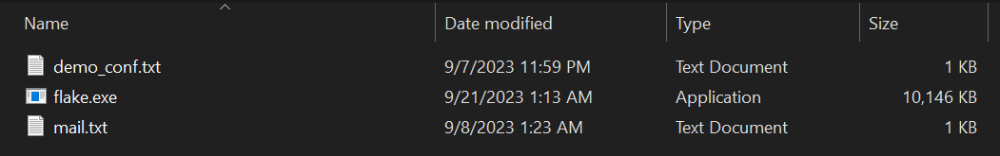
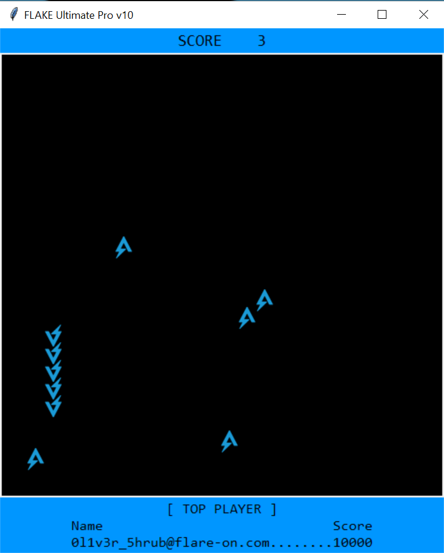
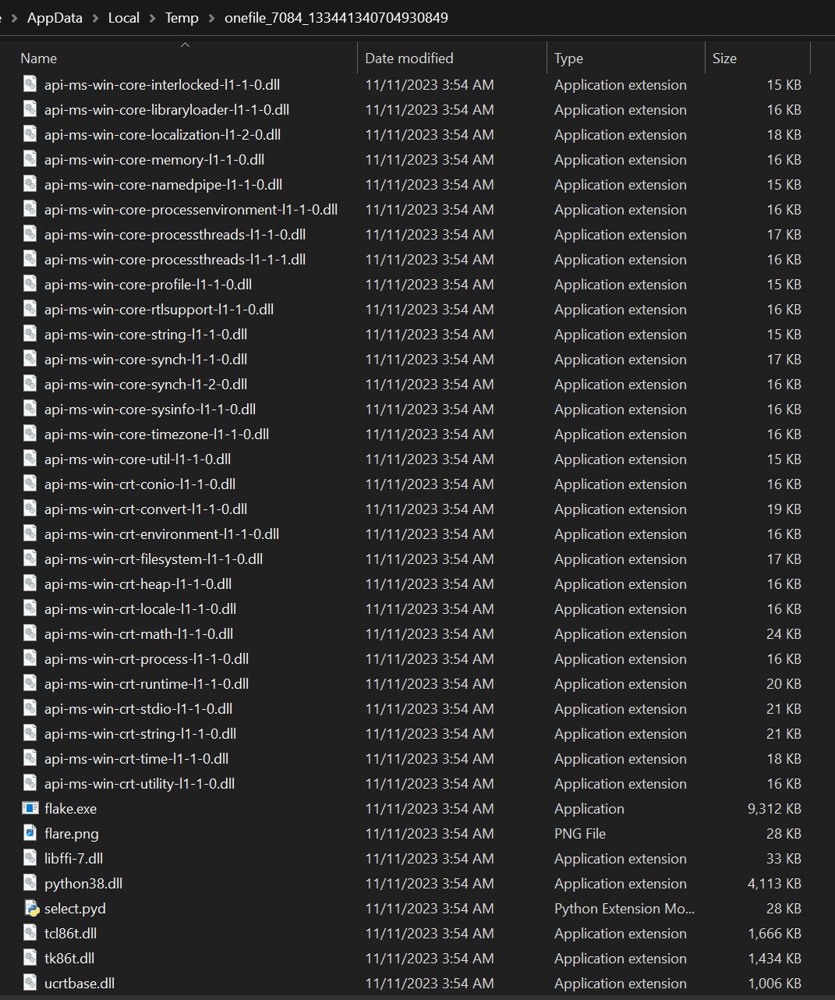
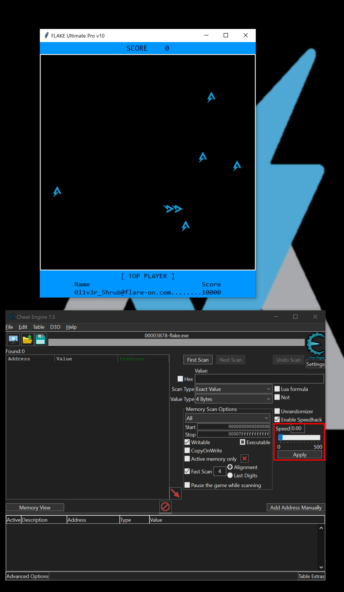
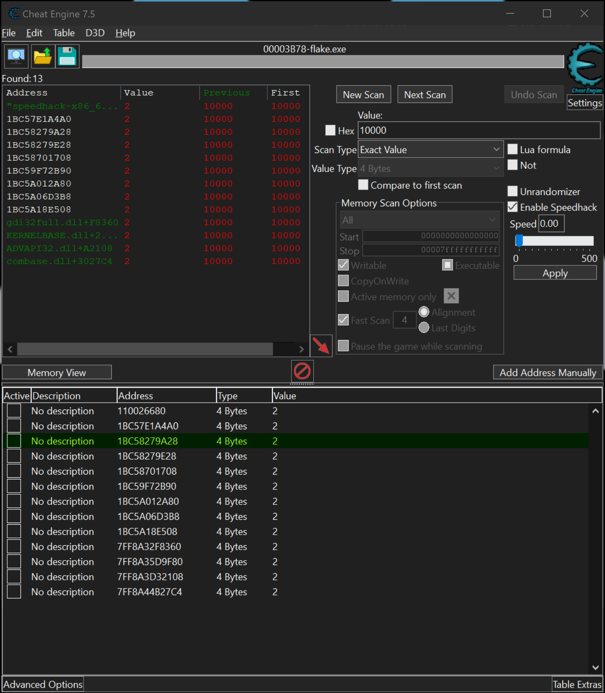
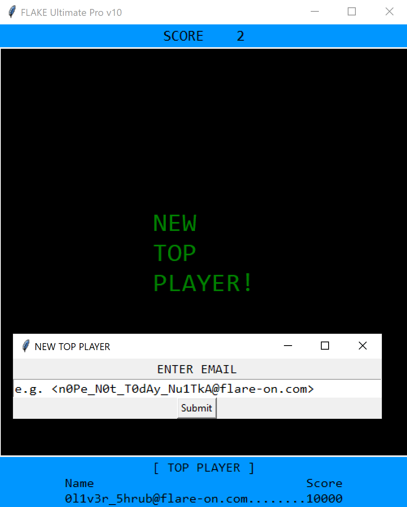

# Challenge 7: flake

Subject: need your help...

Oliver Shrub, Gardens Department Head, keeps bragging about his high score for this rip off Snake game called Flake. I'm pretty sure he found a way to cheat the game because there is no way it's possible to score 10,000 points...I mean the game ships with a sketchy TXT file so there must be something fishy going on here.

Can you look at the game and let me know how I can beat Oliver's high score?

Best,

Nox Shadows Department Head

7-zip password: flare

Challenge file: [flake](../challenge_files/7_flake.7z)

# Solution

To solve this challenge, I had to cheat a bit. I apologize to the challenge author in advance :)

In this challenge, you're provided 3 files:

From the description, we understand that the challenge file is a game that we need to cheat on and get a high score (potentially more than 10000 points). Opening the game show that it's just a basic Slither with Flare style:

The challenge is a compiled Python binary. When you open the game, it extracts necessary files to `%APPDATA%\Local\Temp\onefile_<PID>_<NUMBER>`

To solve this challenge, we'll opt for the easy method, which is to use Cheat Engine!

We'll launch Cheat Engine, specify the process, and enable speed hack so that we do not lose so fast :D

Next, we'll just search for all `10000` 4-byte integer values within the process memory and modify them to be any small value:

Get some more points, die and win!

This solution is probably unintended, but we were asked to cheat! :D
